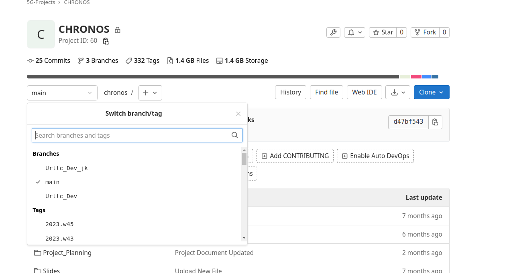

# How to pull the latest tags / branches from upstream and push to our private repo

May be we can write a script to automate this! But for now the manual procedure!
Need to do it occasionally only, though!

1. checkout and move to the folder corresponding to `openairinterface5g`

    ```
    git clone   http://pve1.ngrn.a-star.edu.sg:8880/5g-projects/chronos.git gNodeB
    cd ./gNodeB
    ```

2. Check the configured `remotes`

    ```
    $ git remote -v
    origin	http://pve1.ngrn.a-star.edu.sg:8880/5g-projects/chronos.git (fetch)
    origin	http://pve1.ngrn.a-star.edu.sg:8880/5g-projects/chronos.git (push)
    ```
3. Add the upstream ( OAI ) repo to remotes

    ```
    git remote add upstream https://gitlab.eurecom.fr/oai/openairinterface5g.git
    ```
    ```
    $ git remote -v
    origin	http://pve1.ngrn.a-star.edu.sg:8880/5g-projects/chronos.git (fetch)
    origin	http://pve1.ngrn.a-star.edu.sg:8880/5g-projects/chronos.git (push)
    upstream	https://gitlab.eurecom.fr/oai/openairinterface5g.git (fetch)
    upstream	https://gitlab.eurecom.fr/oai/openairinterface5g.git (push)
    ```

4. fetch all `tags` from the `upstream`

    ```
    $ git fetch --tags  upstream
    ```

    Outputs something like:

    ```
    $ git fetch --tags  upstream
    remote: Enumerating objects: 385780, done.
    remote: Counting objects: 100% (406/406), done.
    remote: Compressing objects: 100% (64/64), done.
    remote: Total 385780 (delta 371), reused 342 (delta 342), pack-reused 385374
    Receiving objects: 100% (385780/385780), 385.16 MiB | 14.03 MiB/s, done.
    Resolving deltas: 100% (319995/319995), done.
    From https://gitlab.eurecom.fr/oai/openairinterface5g
    * [new branch]            128-ues                                           -> upstream/128-ues
    * [new branch]            2021.w46-SnT                                      -> upstream/2021.w46-SnT
    * [new branch]            207-feature-ued-platform-support                  -> upstream/207-feature-ued-platform-support
    * [new branch]            2cw_fairRRscd                                     -> upstream/2cw_fairRRscd
    * [new branch]            340-fix-beamforming-for-multiple-antenna          -> upstream/340-fix-beamforming-for-multiple-antenna
    ...
    ```

5. Check the latest tag is downloaded:

    ```
    git tag --sort=-taggerdate
    ```

    The option `-sort=-taggerdate` will cause the latest `tags` to be listed first.

    ```$ git tag --sort=-taggerdate
    2023.w45
    2023.w45
    2023.w43
    2023.w42
    2023.w41
    2023.w40
    2023.w39
    2023.w38
    2023.w37
    2023.w36
    2023.w34
    2023.w33
    2023.w32
    v2.0.0
    ...
    ```

6. Now push all these tags to the local upstream `origin`

    ```
    git push -u origin --tags
    ```
    
    This should push all the latest tags and the required objects to the `origin` upstream (local).

    ```
    $     git push -u origin --tags
    Enumerating objects: 288415, done.
    Counting objects: 100% (288415/288415), done.
    Delta compression using up to 10 threads
    Compressing objects: 100% (57095/57095), done.
    Writing objects: 100% (288415/288415), 286.08 MiB | 110.92 MiB/s, done.
    Total 288415 (delta 238742), reused 275079 (delta 226915), pack-reused 0
    remote: Resolving deltas: 100% (238742/238742), done.
    To http://pve1.ngrn.a-star.edu.sg:8880/5g-projects/chronos.git
    * [new tag]               2016.w49 -> 2016.w49
    * [new tag]               2016.w50 -> 2016.w50
    * [new tag]               2017.w01 -> 2017.w01
    * [new tag]               2017.w02 -> 2017.w02
    * [new tag]               2017.w03 -> 2017.w03
    * [new tag]               2017.w04 -> 2017.w04
    * [new tag]               2017.w05 -> 2017.w05
    ...
    * [new tag]               2023.w43 -> 2023.w43
    * [new tag]               2023.w45 -> 2023.w45
    * [new tag]               benetel_enb_rel_1.0 -> benetel_enb_rel_1.0
    * [new tag]               benetel_enb_rel_2.0 -> benetel_enb_rel_2.0
    * [new tag]               benetel_enb_rel_3.0 -> benetel_enb_rel_3.0
    ...
    * [new tag]               v1B0.6 -> v1B0.6
    * [new tag]               v1B0.7 -> v1B0.7
    * [new tag]               v1B0.8 -> v1B0.8
    * [new tag]               v2.0.0 -> v2.0.0
    ```

7. Verify by loging into the gitlab project!

    
    
    


